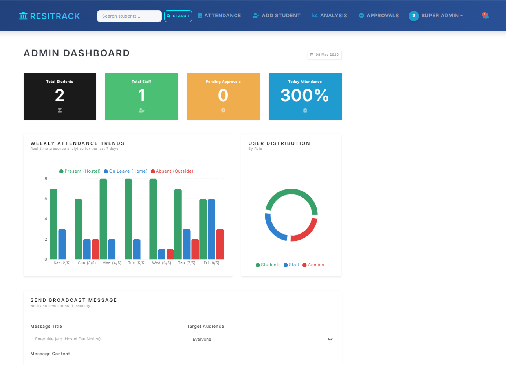
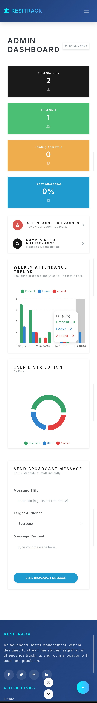

# 🏨 ResiTrack - Hostel Management System

[](https://www.mongodb.com/mern-stack)
[](https://opensource.org/licenses/MIT)
[](http://makeapullrequest.com)

ResiTrack is a comprehensive, enterprise-grade **Hostel Management System** designed to streamline administrative tasks, enhance security, and provide real-time data insights. Built with the **MERN Stack**, it offers a premium, mobile-responsive experience for Administrators, Staff, and Students.

---

## ✨ Visual Preview

<div align="center">
  
  <br>
  <em>Premium Dashboard with real-time analytics and Glassmorphism design.</em>
</div>

<br>

<div align="center">
  
  <br>
  <em>Mobile-optimized interface for on-the-go management.</em>
</div>

---

## 🚀 Key Features

### 👑 Advanced Management Modules
- **Attendance Grievance System:** Students can report incorrect attendance markings directly from their history view. Admins can review and approve corrections with automatic data synchronization.
- **Complaints & Maintenance (Ticketing):** A full-featured ticket system where students can raise maintenance requests (Electrical, Plumbing, etc.) with optional photo proof. Staff can track and resolve tickets in real-time.
- **Broadcast System:** Permission-based broadcast tool for Staff and Admins to send important announcements to all residents.
- **Student Registration & Approval:** streamlined workflow for new student applications with a 30-minute cooling period and administrative verification.

### 🔐 Granular Role-Based Access Control (RBAC)
- **Admin Dashboard:** Full control over users, staff permissions, and student records. Monitor pending tasks via **dynamic notification badges**.
- **Staff Dashboard:** Specialized modules based on assigned permissions (Attendance, Approvals, Leaves, Reports).
- **Student Portal:** Personal dashboard to track attendance trends, current status (Hostel/Home/Outside), and manage tickets.

### 📊 Intelligence & Reporting
- **Dynamic Analytics:** Visual representation of weekly attendance trends and user distribution using Recharts.
- **Real-Time Sync:** Changes made via grievances or attendance marking propagate instantly to all related dashboards and percentages.
- **Report Export:** Generate and download customized CSV reports based on specific date ranges.

### 📱 Premium UI/UX
- **Modern Design:** Glassmorphism elements, sleek transitions, pulsing notification badges, and a curated professional color palette.
- **Fully Responsive:** Optimized for everything from widescreen monitors to small smartphones.

---

## 🛠 Tech Stack

- **Frontend:** React.js, Redux (State Management), React-Bootstrap, Recharts.
- **Backend:** Node.js, Express.js.
- **Database:** MongoDB (Mongoose ODM).
- **Authentication:** JSON Web Tokens (JWT) with Bcrypt hashing.
- **Validation:** Strict server-side schema validation and student-to-user linking logic.

---

## 📁 Project Structure

```bash
Hostel-Management/
├── frontend/          # React Single Page Application
│   ├── src/actions    # Redux Actions (Attendance, Grievance, Complaints, etc.)
│   ├── src/components # Reusable UI Components
│   └── src/screens    # Page-level Views (Dashboards, Management Screens)
├── server/            # Node.js & Express REST API
│   ├── controllers    # Request Handlers (Business Logic)
│   ├── middleware     # Auth & RBAC Middleware
│   ├── models         # MongoDB Schemas (Complaint, Grievance, Attendance)
│   └── routes         # API Endpoints
└── .env               # Environment Configuration
```

---

## ⚙️ Installation & Setup

### 1️⃣ Clone the Repository
```bash
git clone https://github.com/dhruvsaini83/Hostel-Management
cd Hostel-Management
```

### 2️⃣ Install Dependencies
```bash
# Install server dependencies
npm install

# Install frontend dependencies
npm install --prefix frontend
```

### 3️⃣ Environment Configuration
Create a `.env` file in the **root** directory and add the following:
```env
NODE_ENV=development
PORT=5000
MONGO_URI=your_mongodb_connection_string
JWT_SECRET=your_super_secret_key
```

### 4️⃣ Run the Application
```bash
# Run both Frontend & Backend concurrently
npm run dev
```
- **Backend:** `http://localhost:5000`
- **Frontend:** `http://localhost:3000`

---

## 👥 Author

**Dhruv Saini**  
*MCA Student | Full Stack Developer*  
[](https://www.linkedin.com/in/dhruv-saini-30731b1b6/)
[](https://github.com/dhruvsaini83)

---

## 📜 License

This project is open-source and licensed under the **MIT License**.
